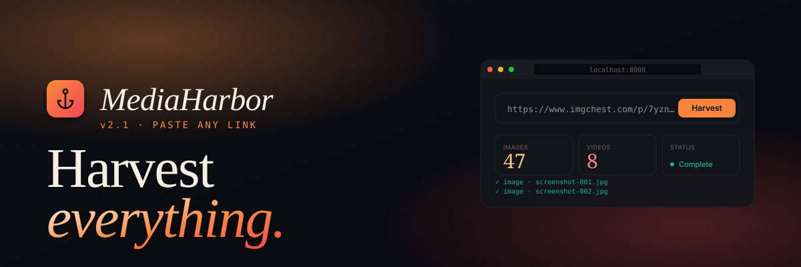

<div align="center">

<a href="https://twarga.github.io/MediaHarborButcher/">
  
</a>

<p>
  <a href="https://github.com/Twarga/MediaHarborButcher/releases/latest">
    
  </a>
  <a href="LICENSE">
    
  </a>
  <a href="https://github.com/Twarga/MediaHarborButcher/actions/workflows/ci.yml">
    
  </a>
  <a href="https://twarga.github.io/MediaHarborButcher/">
    
  </a>
  <a href="https://python.org">
    
  </a>
  <a href="https://react.dev">
    
  </a>
  <a href="https://github.com/yt-dlp/yt-dlp">
    
  </a>
</p>

<p>
  <a href="https://twarga.github.io/MediaHarborButcher/"><b>Landing</b></a> ·
  <a href="https://github.com/Twarga/MediaHarborButcher/releases"><b>Releases</b></a> ·
  <a href="CHANGELOG.md"><b>Changelog</b></a> ·
  <a href="https://github.com/Twarga/MediaHarborButcher/issues"><b>Issues</b></a> ·
  <a href="CONTRIBUTING.md"><b>Contributing</b></a>
</p>

</div>

---

## Table of contents

- [What's new in v2.1](#-whats-new-in-v21)
- [Features](#-features)
- [Quick start](#-quick-start)
- [Usage](#-usage)
- [Settings](#-settings)
- [Output structure](#-output-structure)
- [Architecture](#-architecture)
- [Troubleshooting](#-troubleshooting)
- [Roadmap](#-roadmap)
- [Legal](#-legal)

---

## ✨ What's new in v2.1

- 🎬 **yt-dlp video engine** — 1800+ sites work out of the box: TikTok, Instagram, Twitter, Vimeo, Reddit, Twitch, Dailymotion, and more
- 🍪 **Cookies forwarded** — Playwright's browser cookies are reused for every download, so CDN-protected media works
- 🔁 **Retry & recover** — auto-retry with exponential backoff, Content-Type validation, one-click "Retry Failed" button
- ⌨️ **Keyboard shortcuts** — `Ctrl/Cmd+Enter` to harvest, `Esc` to cancel
- 🎨 **UI polish** — toast notifications, live scan counters, hover animations, better empty states

See the full [CHANGELOG](CHANGELOG.md).

---

## ✨ Features

| | Feature | Description |
|---|---|---|
| 🌐 | **Any Website** | Works on JS-heavy sites, infinite scroll, lazy loading, SPAs |
| 🎬 | **Images & Videos** | JPG, PNG, WebP, GIF, MP4, WebM, HLS/DASH streams → MP4 |
| ✅ | **Select & Download** | Preview every found file, pick exactly what you want |
| ⚡ | **Real-time Progress** | Live scan log + download progress bar with speed & ETA |
| 🛡️ | **Stealth Mode** | Bypasses bot detection on protected sites |
| ⚙️ | **Full Control** | Output folder, subfolders, min image size, format filters, concurrency |
| 🗂️ | **Organized Output** | Per-site folders, separate images/videos dirs, MD5 deduplication |
| 📋 | **Harvest History** | Every session saved locally, one-click to open output folder |
| 🔒 | **100% Local** | No accounts, no cloud, no telemetry. Runs entirely on your machine |

---

## 🖥️ Screenshots

> *(Coming with v2.0 release)*

---

## 🚀 Quick Start

### Requirements

- **Python 3.11+**
- **Node.js 18+**
- **ffmpeg** *(optional — needed for HLS/DASH stream download)*

### Install

```bash
git clone https://github.com/Twarga/MediaHarborButcher.git
cd MediaHarborButcher
chmod +x install.sh
./install.sh
```

### Run

```bash
./run.sh
```

Then open **http://localhost:8000** in your browser.

---

## 📖 Usage

### Mode 1 — Auto Download
Paste a URL → click **Harvest** → everything downloads automatically to your configured folder.

### Mode 2 — Select & Download
Paste a URL → click **Harvest** → watch the live scan → a grid of every found image/video appears → check what you want → click **Download Selected**.

```
┌─────────────────────────────────────────────┐
│  https://example.com/gallery          [Harvest]│
│  ○ Auto Download   ● Select & Download        │
├─────────────────────────────────────────────┤
│  🔵 Launching browser...                     │
│  🔵 Scrolling page (4/15)...                 │
│  ✅ Found 47 images                          │
│  ✅ Found 3 videos                           │
├─────────────────────────────────────────────┤
│  [☑] [☑] [☐] [☑] [☑] [☐] [☑] [☑]         │
│  [☑] [☑] [☑] [☐] [☑] [☑] [☑] [☐]         │
│                                              │
│  34 selected    [Download Selected (34)]     │
└─────────────────────────────────────────────┘
```

---

## ⚙️ Settings

| Setting | Default | Description |
|---|---|---|
| Output folder | `~/Downloads/MediaHarbor` | Where files are saved |
| Per-site folder | `On` | Creates `unsplash.com/` subfolder per domain |
| Images subfolder | `images` | Subfolder name for images |
| Videos subfolder | `videos` | Subfolder name for videos |
| Min image width | `100px` | Filters out icons and tracking pixels |
| Min image height | `100px` | Filters out icons and tracking pixels |
| Include images | `On` | Toggle image extraction |
| Include videos | `On` | Toggle video extraction |
| Allowed formats | *(all)* | Restrict to specific formats (jpg, mp4, etc.) |
| Stealth mode | `On` | Bypass bot detection (slightly slower) |
| Max scroll depth | `15` | How many times to scroll for lazy content |
| Scroll delay | `1.0s` | Pause between scrolls |
| Concurrent downloads | `5` | Parallel download threads |

---

## 📁 Output Structure

```
~/Downloads/MediaHarbor/
└── unsplash.com-2026-05-11/
    ├── images/
    │   ├── a1b2c3d4_photo-1920x1080.jpg
    │   ├── e5f6g7h8_banner.webp
    │   └── ...
    └── videos/
        ├── i9j0k1l2_intro-reel.mp4
        └── ...
```

Files are prefixed with an 8-character MD5 hash to prevent duplicates.

---

## 🏗️ Architecture

```
MediaHarborButcher/
├── backend/
│   ├── main.py          ← FastAPI + SSE endpoints
│   ├── extractor.py     ← Playwright + network intercept + DOM extraction
│   ├── downloader.py    ← async downloads + ffmpeg stream support
│   └── database.py      ← SQLite history + settings
├── frontend/
│   └── src/
│       ├── App.jsx
│       ├── api.js
│       └── components/  ← URLBar, ScanProgress, MediaGrid, DownloadBar, ...
├── docs/
│   └── index.html       ← GitHub Pages landing page
├── install.sh
└── run.sh
```

**Stack:** Python 3.14 · FastAPI · Playwright · aiohttp · ffmpeg · React 18 · Vite · Tailwind CSS · SQLite

---

## 🔧 Troubleshooting

**Backend won't start**
```bash
source .venv/bin/activate
cd backend && uvicorn main:app --reload
```

**No images found on a site**
→ Enable **Stealth Mode** in Settings. Some sites block automated browsers.

**403 errors during download**
→ The site requires login/cookies. This tool works on publicly accessible pages only.

**ffmpeg not found**
```bash
# Linux
sudo apt install ffmpeg

# macOS
brew install ffmpeg
```

**Port 8000 already in use**
```bash
# Find and kill the process
lsof -i :8000
kill -9 <PID>
```

---

## 🗺️ Roadmap

- [x] Phase 0 — Project setup & planning
- [x] Phase 1 — Backend (unified extractor, SSE, video support, streaming downloads)
- [x] Phase 2 — Frontend (components, live grid, select mode, error boundary)
- [x] Phase 3 — Integration hardening (security, CORS lockdown, input validation)
- [x] Phase 4 — Install script & single-command run
- [x] Phase 5 — v2.0 release

See [`remake.md`](remake.md) for the complete technical design.

---

## ⚖️ Legal

This tool is for **personal use only**.

- Only download content you have the right to download
- Respect the copyright and terms of service of websites you use this on
- The authors are not responsible for misuse

---

## 📄 License

MIT — see [LICENSE](LICENSE)

---

<div align="center">
Made with ☕ by <a href="https://github.com/Twarga">Twarga</a>
</div>
